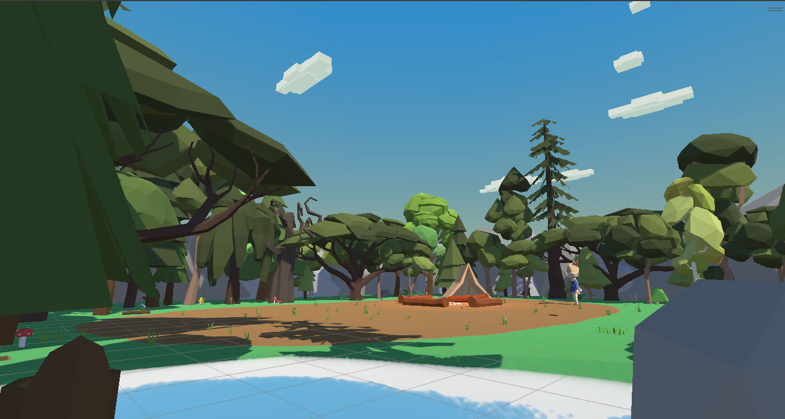
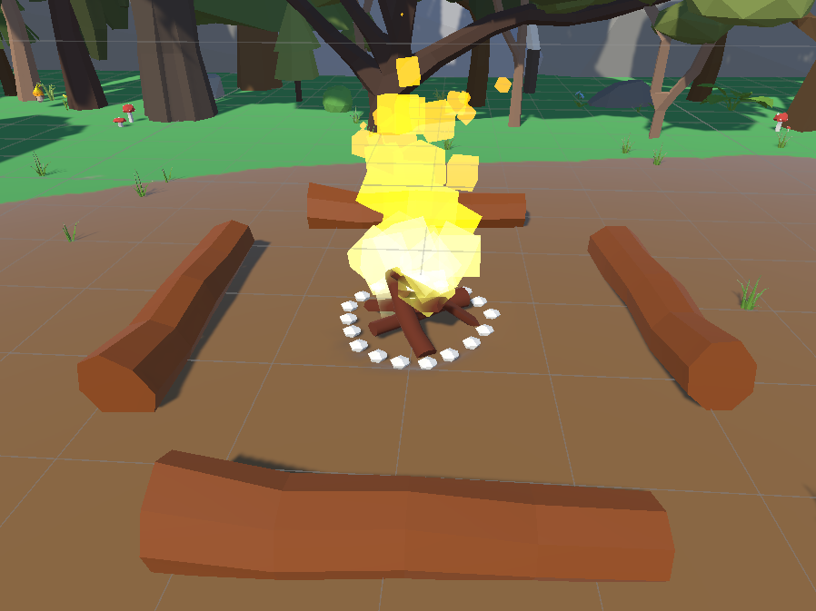
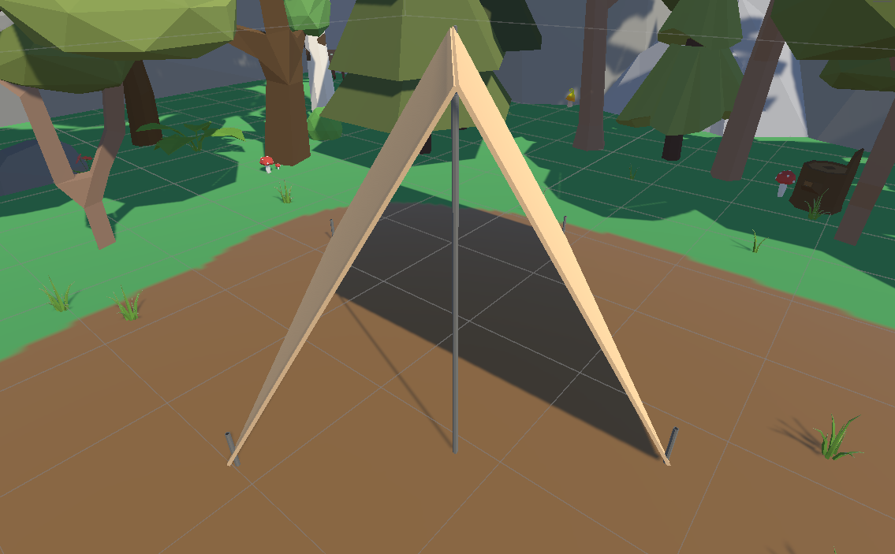
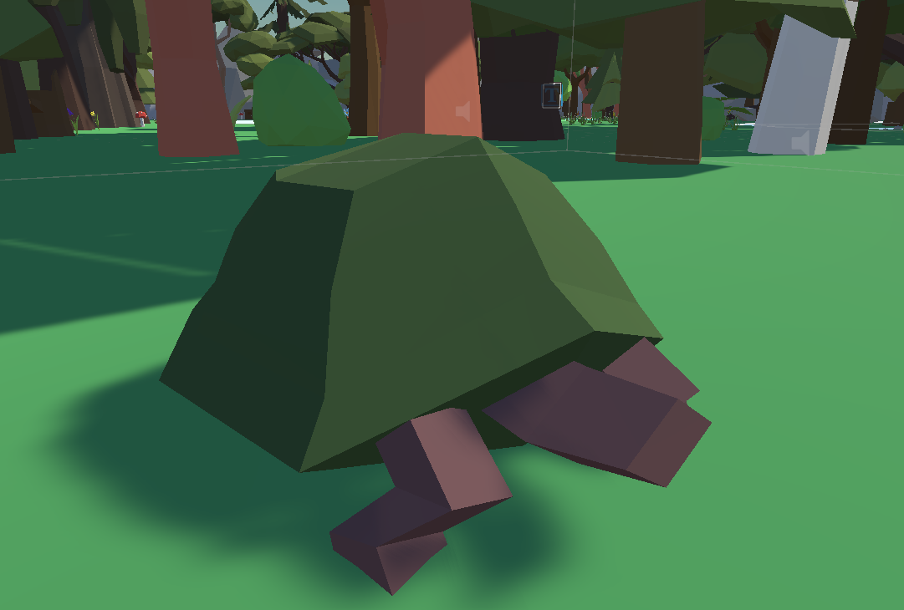
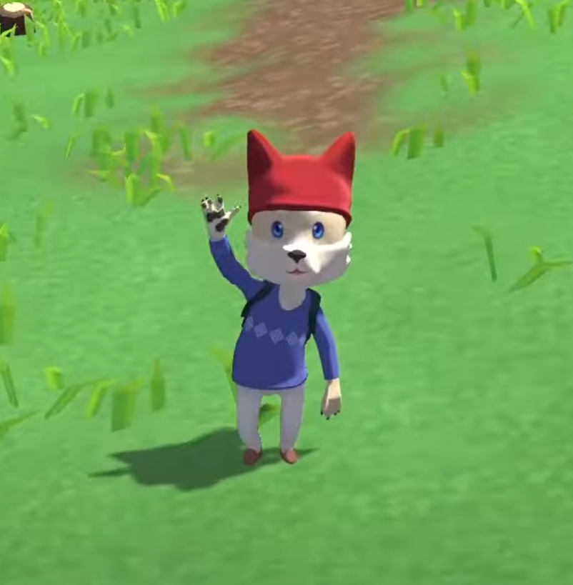
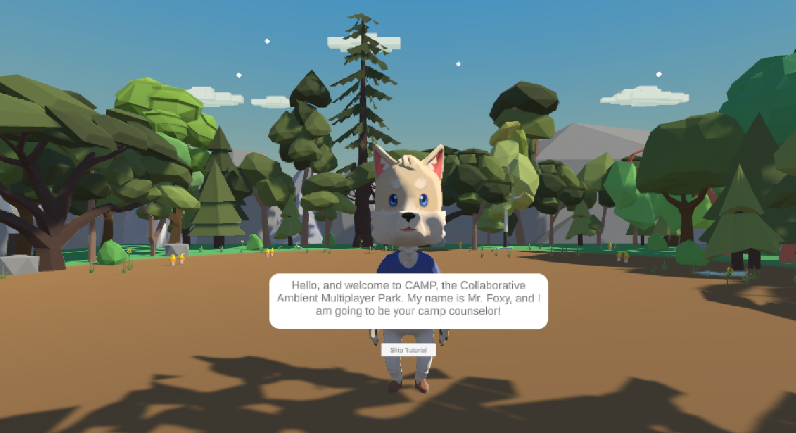
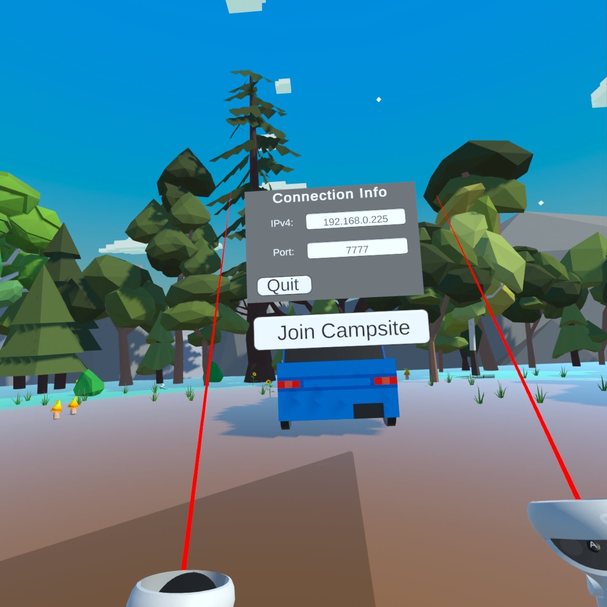

# C.A.M.P - HCI Capstone Project

This is our CS-4784 Senior Design project. 

Read Me Directory:
- [Project Details](#project-details)
- [Project Features](#project-features)
- [How to Run the Application](#running-the-application-step-by-step-guide)
- [How to Contribute to the Application](#contributing-to-the-application-step-by-step-guide)

### Team Members:

Alexander Georgiev

Rowan Cusano

Sophya Hargenrater

Evan Lee

Felix Lopez

Keith Lowry

Nick DeFelice

## Project Details:

The C.A.M.P, Cozy Ambient Multiplayer Park, offers an immersive experience for novice campers through VR technology, Generative AI, and Unity. Users interact with the virtual campsite, engaging in collaborative tasks like building a campfire, setting up a tent, and observing wildlife. Human-Computer interaction is central, facilitated by controller-based interactions and C\# scripts for task completion. The integration of OpenAI's speech generation enhances the Extended reality, with a fox NPC providing interactive dialogue and informative assistance for any necessary guidance. Unity Assets help create a rich environment, complemented by 3D spatial audio for immersion. Animal behavior is driven by AI navigation and used to help campers learn more about the type of animals they may encounter. Future plans include expanding camping tasks, environments, and weather systems. The project encapsulates the intersection of gaming, education, and technology, offering a platform for learning camping skills in an interactive virtual setting.

## Project Features:

### Fire Task:

To create a fire, we added tags to twigs around the campsite to distinguish them from other objects. Additionally, we tagged a matchbox and a set of matches. Inside the fire area, we implemented a trigger zone to monitor incoming objects. Upon verifying the amount of sticks present, we cleared the area of twigs and activated a pre-made fire prefab, simulating the creation of fire. Similarly, for the matchbox, players had to physically touch a match to the matchbox, updating the match's tag to ``lit," and activating a flame prefab on the match. After a designated number of matches were thrown, as specified in the script, the flame for the fire pit would be enabled, creating the illusion of lighting the fire.

### Tent Task:

The tent assembly task followed a similar concept, requiring players to place each part of the tent in its designated spot to trigger the appearance of prefabs. However, stakes added an additional layer of interaction. Upon placing all components, players needed to nail in the stakes. We achieved this by adding a tag for the hammer and implementing trigger zones on top of each nail. When the hammer entered a trigger zone, it would gradually push the stake down, simulating the nailing process.

### Animal Task:

Finally, the animal identification task utilized XR interactables for animal prefabs, enabling users to click on them. Clicking on an animal triggered a script that identified the object and displayed the information in a message box for the user. While all tasks functioned smoothly in single-player mode, adjustments were necessary to work correctly in multiplayer scenarios. Despite the need for reworking, the fundamental concepts remained.

### AI Assistant:

We used OpenAI's ChatGPT-4 API and the Whisper API to develop a responsive Non-Player Character (NPC) that players could interact with and ask questions while completing tasks. The implementation process began with input handling, where users have the flexibility to either type or verbally record their prompts. The typing interface was used mainly for testing the NPC's functionality on PC. The NPC can also record player mic input if they click on the microphone icon present on its floating UI canvas. To handle these vocal inputs, we accessed the Whisper API, which efficiently converts speech to text, ensuring that the NPC can understand and process user commands regardless of the mode of communication used. Once the inputs are processed, they are fed into the ChatGPT-4 API. We took considerable steps to tailor the responses of ChatGPT to fit seamlessly within the context of our virtual camping world. This involved detailed prompt engineering to define the NPC’s personality, knowledge about the world, and specific details about tasks and the surrounding environment. Such customization ensures that the NPC remains in character at all times and provides answers that are contextually appropriate to the virtual environment and the user's inquiries. Once a response is generated, it is then presented to the user on a world-space canvas that hovers around the NPC, turning to face the player that is inside its collider.

### Tutorial:

We made sure to add a tutorial to guide users through navigating our virtual game. Once they learn how to pick up an item, throw an item, click on things, etc. they will be able to use these same skills in the game.

At the end of the tutorial we have a menu to connect you to the server where the users can plugin the servers IP and join into one campsite.

### Task Board

Additionally, we made a dynamic task board that updates as users complete tasks so they always know what they are meant to be doing and don't get confused. 

## Running the Application: Step-by-Step Guide

### 1. Install GitHub Desktop
   - If you haven't already, download and install GitHub Desktop from [here](https://desktop.github.com/).

### 2. Create a folder to hold your repository 
   - Choose or create a folder on your local machine where you want to store your project repository.

### 3. Clone the Repository into that folder
   - Open GitHub Desktop, navigate to the "File" menu, and select "Clone Repository".
   - Choose the repository you want to clone from the list or paste its URL.
   - Specify the local path (the folder you created in step 2) where you want to clone the repository.
   - Click on "Clone".

### 4. Upload the C.A.M.P_Client.apk to your VR headset using SideQuest from the Build folder
   - Install SideQuest: Ensure SideQuest is installed on your computer. You can download it from the official SideQuest website.
   - Connect VR Headset: Use a USB cable to connect your VR headset to your computer.
   - Open SideQuest: Launch the SideQuest application on your computer.
   - Locate the APK: Navigate to the Build folder on your computer and find the C.A.M.P_Client.apk file.
   - Upload the APK: Drag and drop the C.A.M.P_Client.apk file into the SideQuest window. This will initiate the installation process on your VR headset.

### 5. On your computer, navigate to the Build folder and launch C.A.M.P.exe to start the server.
   - Locate the Build Folder: Find the Build folder on your computer where the C.A.M.P.exe file is stored.
   - Launch the Server: Double-click the C.A.M.P.exe file to launch it.
   - Verify Server Running: Ensure that the server is running properly before you attempt to use the VR application. This is necessary for the VR application to communicate with your computer and function correctly.

*Note: If you prefer using the terminal, you can perform these steps there, but proceed with caution if you're less familiar with it.*
